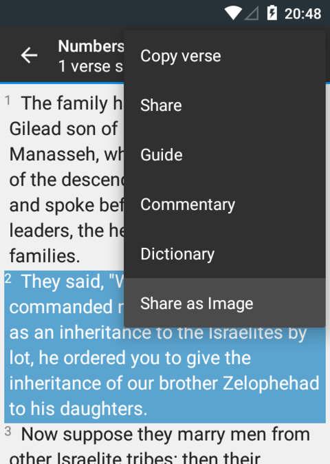

## Introduction

Your app can be called from within Alkitab / Quick Bible when the user selects a verse or multiple verses. This is supported since Alkitab / Quick Bible version 4.3.

This can be useful if your app provides extra information regarding the selected verse(s), such as a commentaries, dictionaries, guides, devotions, share providers, or anything that you can think of! We call those "extension" apps.

For example: You create an app called "ImageSharer". This app creates images from a verse text selected by the user. So, the user would select a verse from Alkitab / Quick Bible, tap the overflow menu icon, and select "Share as Image" (This is because ImageSharer is installed). Then, ImageSharer receives the verse location (book, chapter, and verse number) along with the text from Alkitab / Quick Bible. ImageSharer draws an image containing the verse text in a nice background and lets the user do anything with it.



"Share as Image" is an example extension.

## Integration

To make your app works as an extension app, you have to declare on your application manifest `AndroidManifest.xml` the following activity:

```xml
<activity
android:name="your.own.Activity"
android:label="Extension Title"
android:exported="true"
android:enabled="true">
	<intent-filter>
		<action android:name="yuku.alkitab.extensions.action.SHOW_VERSE_INFO" />
	</intent-filter>
	<meta-data
		android:name="supportsMultipleVerses"
		android:value="true"
/>
<meta-data
	android:name="includeVerseText"
	android:value="true"
/>
<meta-data
	android:name="includeVerseTextFormatting"
	android:value="false"
	/>
</activity>
```

The value of `android:label` attribute will be used as the menu item title in Alkitab / Quick Bible.

As shown above, there are optional meta-data tags that you can specify.

- `supportsMultipleVerses` (`true` | `false`, default = `false`) Indicates whether the extension can be invoked when the user selects more than 1 verse. When `false`, if the user selects more than 1 verse, the extension will not be shown in the Alkitab / Quick Bible menu.

- `includeVerseText` (`true` | `false`, default = `false`) Indicates whether to send the verse text as well. Keep this `false` unless you need it, because this can decrease performance.

- `includeVerseTextFormatting` (`true` | `false`, default = `false`) Only relevant when `includeVerseText` meta-data value is `true`. When `true`, the verse text will contain [formatting tags](https://docs.google.com/document/d/1SGk70g7R3UfN1MTF5jFE9u5bNCY7J9Jeftiq5RjZA0A/edit) (the character '`@`' followed by another character, or '`@<`' followed by some auxiliary string and followed by '`@>`'). If you don't understand this, just keep it false.

## Receiving the selected verses

When the user selects one or more verses, the extension app will appear on the overflow menu of Alkitab / Quick Bible app.

In order for your application to know which verse(s) the user selected, you need to examine the extras of the intent that is sent to your application's activity. The following extras are sent:

### `aris`

Type: integer array

The value is an integer array in ascending order, where each element of the array is an ari. The length of the array is equal to the number of selected verses. Ari is a value that contains the book, chapter, and verse.

The book, chapter, and verse in an ari are encoded as (book \<\< 16 | chapter \<\< 8 | verse), where:

- book starts at 0 for Genesis, and so on until 65 for Revelation

- chapter and verse start at 1

To get the book from an ari, use the following:

```text
int book = (ari & 0xff0000) >> 16;
```

To get the chapter number from an ari, use the following:

```text
int chapter = (ari & 0xff00) >> 8;
```

To get the verse number from an ari, use the following:

```text
int verse = ari & 0xff;
```

### `verseTexts`

Type: string array

This extra only exist when `includeVerseText` meta-data is true. The value is a string array where each element contains the text from the selected verse. If the `includeVerseTextFormatting` meta-data is true, the text will also contains [formatting tags](https://docs.google.com/document/d/1SGk70g7R3UfN1MTF5jFE9u5bNCY7J9Jeftiq5RjZA0A/edit).

If the user uses the Split feature in Alkitab / Quick Bible app, the text sent is the primary one.

Each element corresponds to the `aris` extra value. An element may be null or empty string if the verse text is not available for a certain reason (e.g. the user selects a verse in a secondary version when using Split feature, but that verse is not available on the primary version).

## Example

This example extension draws a verse to an bitmap, saves it as an image file, and then shares it using the standard Android sharer.

AndroidManifest.xml

```xml
<activity
android:name="yuku.alkitab.imagesharer.ShareVerseActivity"
android:label="Share as Image"
android:exported="true"
android:enabled="true">
	<intent-filter>
		<action android:name="yuku.alkitab.extensions.action.SHOW_VERSE_INFO" />
	</intent-filter>
	<meta-data
		android:name="supportsMultipleVerses"
		android:value="false"
/>
<meta-data
	android:name="includeVerseText"
	android:value="true"
/>
<meta-data
	android:name="includeVerseTextFormatting"
	android:value="false"
	/>
</activity>
```

ShareVerseActivity.java

```java
public class ShareVerseActivity extends Activity {
	public void onCreate(Bundle savedInstanceState) {
		super.onCreate(savedInstanceState);

		// get the selected verse and its text
		Intent intent = getIntent();
		int[] aris = intent.getIntArrayExtra("aris");
		String[] verseTexts = intent.getStringArrayExtra("verseTexts");

		// safety check
		if (aris == null || aris.length < 1
|| verseTexts == null || verseTexts.length < 1) {
			finish();
			return;
		}

		// this example does not support multiple verses
// so use the first one only
int book = (aris[0] & 0xff0000) >> 16;
int chapter = (aris[0] & 0xff00) >> 8;
int verse = aris[0] & 0xff;

		// get the name of book
		String bookName = "unknown";
		if (book < 66) {
			bookName = new String[] {"Genesis", "Exodus", "Leviticus", "Numbers", "Deuteronomy", "Joshua", "Judges", "Ruth", "1 Samuel", "2 Samuel", "1 Kings", "2 Kings", "1 Chronicles", "2 Chronicles", "Ezra", "Nehemiah", "Esther", "Job", "Psalms", "Proverbs", "Ecclesiastes", "Song of Solomon", "Isaiah", "Jeremiah", "Lamentations", "Ezekiel", "Daniel", "Hosea", "Joel", "Amos", "Obadiah", "Jonah", "Micah", "Nahum", "Habakkuk", "Zephaniah", "Haggai", "Zechariah", "Malachi", "Matthew", "Mark", "Luke", "John", "Acts", "Romans", "1 Corinthians", "2 Corinthians", "Galatians", "Ephesians", "Philippians", "Colossians", "1 Thessalonians", "2 Thessalonians", "1 Timothy", "2 Timothy", "Titus", "Philemon", "Hebrews", "James", "1 Peter", "2 Peter", "1 John", "2 John", "3 John", "Jude", "Revelation"}[book];
		}

		// construct a reference string: Bookname chapter:verse
		String reference = bookName + " " + chapter + ":" + verse;

		// draw on a bitmap
		Bitmap b = Bitmap.createBitmap(800, 800, Bitmap.Config.ARGB_8888);
		Canvas c = new Canvas(b);
		Paint p = new Paint();
		p.setColor(0xff0000ff); // blue

		c.drawText(reference, 40, 200, p);
		c.drawText(verseTexts[0], 40, 240, p);

		// save as image and share
		try {
			FileOutputStream f = new FileOutputStream("/sdcard/tmp.png");
		b.compress(Bitmap.CompressFormat.PNG, 100, f);
		f.close();

		ShareCompat.IntentBuilder.from(this)
			.setType("image/png")
			.addStream(Uri.fromFile(new File("/sdcard/tmp.png")))
			.startChooser();
	} catch (IOException e) {
		Log.e("Error", "error saving image", e); // do something
		}
	}
}
```
