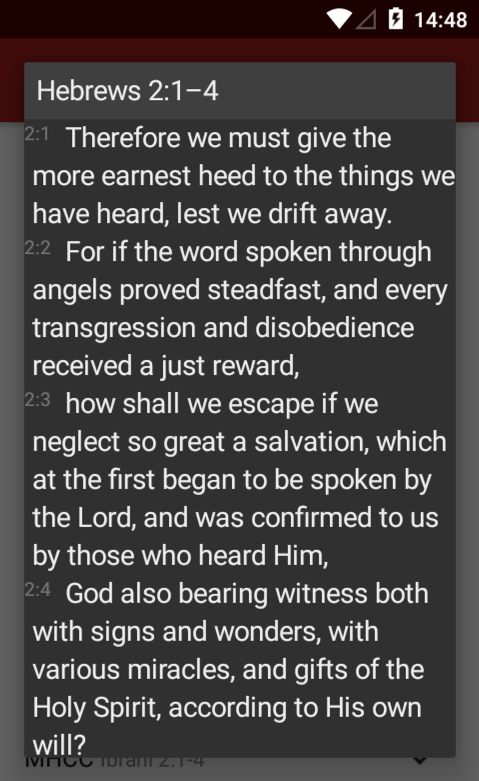

# Opening Verses

The Bible for Android app is able to be requested to open a specific verse or a range of verses. If you have a Bible-related app, you can display text from the Bible without having to include it in your app. The Bible for Android app will be able to display the text in either a popup window or in a new screen, depending on your choice.

## Dialog



To open a verse in a dialog (as seen above), start an intent with the name “`yuku.alkitab.action.SHOW_VERSES_DIALOG`”. The verses to be opened can be specified by adding a String extra called `target` to the intent/

### Specifying target verses

You can specify the target verse in 3 different ways: **ari**, **OSIS id**, or **lid**.

**Ari** is an integer that contains the book id, chapter number, and verse number. The Book ID identifies the books of the Bible in sequential order, starting from 0 (Genesis) until 65 (Revelation).

Multiply the book id by 65536, the chapter number by 256, and add those numbers together with the verse number to get the ari of a particular verse.

For example, the ari of Genesis 2:3 is:

0 \* 65536 + 2 \* 256 + 3 = 515

The ari of Exodus 20:2 is:

1 \* 65536 + 20 \* 256 + 2 = 70658

**OSIS id** is written with the format \[OSIS book id\].\[chapter number\].\[verse number\]. [This document](https://docs.google.com/document/d/1jGbKZnalt4_iYHs9IhfgeRHABfpDb8f8wNz_rG9jFkA/edit) lists out all the valid OSIS book IDs.

For example, the OSIS id of Genesis 2:3:

Gen.2.3

The OSIS id of Exodus 20:2 is:

Exod.20.2

**Lid** is a number from 1 to 31102 that specifies the location of a verse according to its ordering in the King James Version. 1 refers to the first verse, which is Genesis 1:1, and 31102 refers to the last verse, which is Revelation 22:21.

For example, the Lid of Genesis 2:3 is:

34

To specify whether an ari, OSIS id or Lid is provided, prefix it with "a:", "o:", or "lid:" respectively.

In other words, when any of the following is put as the value of the String extra called `target`, Genesis 2:3 will be opened:

```text
a:515
o:Gen.2.3
lid:34
```

### Sample code

```text
Intent intent = new Intent("yuku.alkitab.action.SHOW_VERSES_DIALOG");
intent.putExtra("target", "o:Gen.2.3");
intent.addFlags(Intent.FLAG_ACTIVITY_NEW_DOCUMENT);
startActivity(intent);
```

The flag `FLAG_ACTIVITY_NEW_DOCUMENT` is added so as to ensure that an old activity with previous data is not reused.

### Verse ranges

Multiple verses can be displayed by specifying a range using dashes and commas. For example, this will show Genesis 2:3 to 2:5:

```text
o:Gen.2.3-Gen.2.5
```

Note that you have to write out the starting and ending verses completely. For example,. `o:Gen.2.3-5` is invalid.

To specify non-sequential range of verses, you can use a comma like this:

```text
o:Gen.2.3,Gen.2.10-Gen.2.12
a:515,522-524
```

If you have any questions, please contact yukuku@gmail.com.
