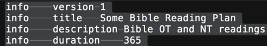

# How to make your own reading plan

The writing format of reading plan source is similar to the [yet file format](https://docs.google.com/document/d/1SGk70g7R3UfN1MTF5jFE9u5bNCY7J9Jeftiq5RjZA0A/edit). The file extension is **.rpa**.

The file consists of lines, and each line consists of fields (columns) separated by tabs, one tab for each field. *Make sure you use tabs and not spaces. Do not use multiple tabs as a separator between fields*.

For a quick overview of how they would look, we provide some [samples](https://drive.google.com/drive/folders/1jVAM5-iVXStv_HbUjwC3UBA9qXIU45XA?usp=sharing) from users who has successfully created a plan.

You have to create the **info section** and **days section** in your .rpa file.

### Info section

Example:

```text
info	version	1
info	title	M'Cheyne Bible Reading Plan
info	description	Daily Old Testament, New Testament, and Psalms or Gospels
info	duration	365
```

It always starts with "info", then a tab, a key (see below), another tab, and a value (see below).

Explanation:

| *key* | *example value* | *description* |
| --- | --- | --- |
| `version` | `1` | File format version. Currently, it is always 1. |
| `title` | `M'Cheyne Bible Reading Plan` | Title of this reading plan |
| `description` | `Daily Old Testament, New Testament, and Psalms or Gospels` | Description of this reading plan. It can be as long as needed, but it must be contained within one line. |
| `duration` | `365` | Number of days required to finish this plan. |

### Days section

Example:

```text
day	1	Gen.1.1-Gen.1.10	Matt.1
day	2	Gen.1.11-Gen.1.20	Matt.2
```

The first line means that the first day's plan consist of *2* readings:

- Genesis 1:1 to Genesis 1:10

- Matthew 1 (the whole chapter)

The second day also has 2 readings: Genesis 1:11-20, and Matthew 2.

#### Explanation

```text
day	day_number	range	range	…
```

`day_number` is 1 to the last day as specified in duration on the header.

Each of the `range` is separated by a tab (not spaces).

`range` is indicated by one of the following:

```text
	start-end
	start
```

`start` is a `verse_spec`.

`end` is a `verse_spec`.

In case that range has a `start` but no `end`, the `end` is assumed to be the same as the `start`. This only makes sense for verse 0 (see below).

`verse_spec` is one of:

```text
	ari decimal number (e.g. 256, 131072)
	ari hex number (e.g. 0x000100)
	lid number prefixed by "lid:" (e.g. lid:1, lid:31102)
	OSIS id with optional verse (e.g. Gen.1, Ps.119.1)
```

In case of ari, the verse number 0 means the first verse for `start`, and the last verse for `end`.

In case of osis id, omitted verse means the first verse for `start`, and the last verse for `end`. How to write OSIS ids is shown below.

### Writing OSIS ids

The book names needs to be written as following. Please make sure that it is exactly the same, for example, Exodus is "Exod", not "Ex" or "Exo".

**Old Testament books**

```text
Gen Exod Lev Num Deut Josh Judg Ruth 1Sam 2Sam 1Kgs 2Kgs 1Chr 2Chr Ezra Neh Esth Job Ps Prov Eccl Song Isa Jer Lam Ezek Dan Hos Joel Amos Obad Jonah Mic Nah Hab Zeph Hag Zech Mal
```

**New Testament books**

```text
Matt Mark Luke John Acts Rom 1Cor 2Cor Gal Eph Phil Col 1Thess 2Thess 1Tim 2Tim Titus Phlm Heb Jas 1Pet 2Pet 1John 2John 3John Jude Rev
```

**Single chapter books**

For books with one chapter, like Obadiah, Philemon, 2 John, 3 John, and Jude, make sure that a chapter number (which is always 1) is written. For example, the first verse of Jude must be written as `Jude.1.1`, and the last verse of Jude must be written as `Jude.1.25`. Writing it as `Jude.25` would not work. Hence, if you want a reading to be the whole book of Jude, you can write it either as `Jude.1` or `Jude.1.1-Jude.1.25`

**Multiple chapters**

Make sure that when a reading spans multiple chapters, such as Matthew 1 to Matthew 3, it is written like `Matt.1-Matt.3`, i.e. with `Matt` repeated. It is incorrect to write it as `Matt.1-3`.

### Publishing

When you’ve finished, upload your **.rpa** file at [www.alkitab.app/rp/upload](https://www.alkitab.app/rp/upload) to use that on the Bible for Android app.

If you have any questions, or you need to delete/replace/edit some of the submitted entries, please contact help@bibleforandroid.com.

### Common mistakes

If you get an error when uploading the .rpa file, please check for the following.

Tabs are used to separate fields (columns) and not spaces. If you use Sublime Text to edit the .rpa file, you can select all text and visually examine it to know whether a character is a space or a tab. A tab looks like a horizontal line, as follows:



The value of `duration` on the **info section** must match the number of days in the **days section**.

When writing verse ranges, you must mention the end of a range in complete form. For example, Ecclesiastes chapter 1 to chapter 3 is not written as `Eccl.1-3`, but `Eccl.1-Eccl.3`. To spot for this mistake, if your text editor supports regular expressions, search for `-\d+\b`. Update 2016-04-26: For convenience, now you can mention only *verse* or *chapter*.*verse* for the end of the range.

Separate book name and chapter number with a period, like `Zeph.3` instead of `Zeph3`. To spot for this mistake, if your text editor supports regular expressions, search for `[a-z]\d`.
