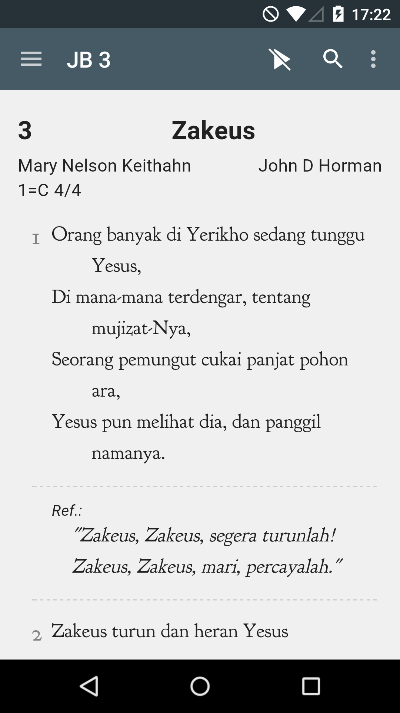

# Making song books / Membuat buku lagu

Use a plain-text `.txt` file to submit a song book or hymnal for
Alkitab / Quick Bible. The publishing tools convert the text to song documents;
the app downloads the resulting data rather than opening the `.txt` file.

Gunakan berkas teks biasa (`.txt`) untuk mengirimkan buku lagu atau kumpulan
nyanyian bagi Alkitab / Quick Bible. Alat penerbitan mengubah teks menjadi
dokumen lagu; aplikasi mengunduh hasilnya, bukan membuka berkas `.txt` langsung.

## File format and editor / Format berkas dan editor

Save as UTF-8 with LF (Unix) line endings. Use a plain-text editor such as
Visual Studio Code, Sublime Text, or Notepad++. If you use TextEdit, select
plain-text mode. A Word document or an RTF file is not a song-book source.

Simpan dengan pengodean UTF-8 dan akhir baris LF (Unix). Gunakan editor teks
biasa seperti Visual Studio Code, Sublime Text, atau Notepad++. Jika memakai
TextEdit, pilih mode teks biasa. Dokumen Word atau berkas RTF bukan berkas
sumber buku lagu. Hubungi kami jika Anda memerlukan bantuan dengan formatnya.

## Song structure / Struktur lagu

Put metadata before the lyrics. Separate a metadata name from its value with
a space. Key and time signatures are standalone lines. Omit optional lines
when their information is unavailable. Replace the angle-bracketed placeholders
in the example below with the actual song information.

Tuliskan keterangan sebelum lirik. Pisahkan nama keterangan dan nilainya
dengan spasi. Nada dasar dan birama ditulis pada baris tersendiri. Keterangan
yang tidak tersedia boleh dihilangkan. Ganti contoh isian dalam tanda kurung
sudut di bawah ini dengan keterangan lagu yang sebenarnya.

```text
code <song number>
title <song title>
title_original <original-language title>
1=C
4/4
tune <tune name>
authors_lyric <lyricist>; <another lyricist>
authors_music <composer>; <another composer>
scriptureReferences Gen.8.10

*1
<first stanza>

*ref
<refrain, written once>

*2
<second stanza>

*3
<third stanza>

===
```

| Field or marker | English | Bahasa Indonesia |
| --- | --- | --- |
| `code` | Song number or code, required and unique within the book | Nomor atau kode lagu, wajib diisi dan harus unik dalam buku |
| `title` | Song title, required | Judul lagu, wajib diisi |
| `title_original` | Original title if the song has been translated | Judul asli jika lagu diterjemahkan |
| `1=C` | Key: the tonic (do) is C; for D, write `1=D` | Nada dasar: do adalah C; untuk D, tulis `1=D` |
| `4/4` | Time signature; separate multiple signatures with commas, such as `2/4, 3/4` | Birama; pisahkan beberapa birama dengan koma, misalnya `2/4, 3/4` |
| `tune` | Tune name; different songs can share a tune | Nama melodi; beberapa lagu dapat memakai melodi yang sama |
| `authors_lyric` | Lyricists, separated by semicolons | Pengarang lirik, dipisahkan dengan titik koma |
| `authors_music` | Composers, separated by semicolons | Pengarang musik, dipisahkan dengan titik koma |
| `scriptureReferences` | Scripture references in OSIS format | Acuan ayat dalam format OSIS |
| `*1`, `*2`, `*3` | Start of each numbered stanza | Awal setiap bait bernomor |
| `*ref` | Refrain | Refrein |
| `===` | Divider between songs | Pemisah antarlagu |

Every song needs a code, a title, and lyrics. Even a song with one stanza
needs `*1` before its first lyric line. Write the refrain once; do not copy it
after each stanza. All other metadata is optional.

Setiap lagu harus memiliki kode, judul, dan lirik. Lagu yang hanya memiliki
satu bait tetap memerlukan `*1` sebelum baris lirik pertama. Tuliskan refrein
satu kali saja; tidak perlu menyalinnya setelah setiap bait. Keterangan
lainnya bersifat opsional.

For scripture references, use the [OSIS book names](reading-plans.md#osis-book-names).
Untuk acuan ayat, gunakan nama kitab OSIS yang tercantum pada tautan tersebut.

## Example / Contoh

The examples below show the song-book text format.
Contoh di bawah ini menunjukkan format teks buku lagu.

```text
code 3
title Zakeus
1=C
4/4
authors_lyric Mary Nelson Keithahn
authors_music John D Horman

*1
Orang banyak di Yerikho sedang tunggu Yesus,
Di mana-mana terdengar, tentang mujizat-Nya,
Seorang pemungut cukai panjat pohon ara,
Yesus pun melihat dia, dan panggil namanya.

*ref
"Zakeus, Zakeus, segera turunlah!
Zakeus, Zakeus, mari, percayalah."

*2
Zakeus turun dan heran Yesus menyapanya.
Dia sadar tiada haknya menjamu Sang Kudus,
Pada Yesus <u>dia</u> berkata: "Ku orang berdosa,
namun saat Kau panggilku, ku janji berubah."

===
```



## Underlining / Garis bawah

Use `<u>...</u>` to underline a word or part of a word sung as one syllable
or beat. For example, write `se<u>mua</u>` if “semua” is sung as “se-mua”
rather than “se-mu-a”. A diphthong such as “bagai”, normally pronounced
“ba-gai”, does not need an extra underline merely to indicate that diphthong.

Gunakan `<u>...</u>` untuk menggarisbawahi kata atau bagian kata yang
dinyanyikan sebagai satu suku kata atau ketukan. Misalnya, tulis
`se<u>mua</u>` jika “semua” dinyanyikan sebagai “se-mua”, bukan “se-mu-a”.
Diftong seperti “bagai”, yang biasanya dibaca “ba-gai”, tidak perlu diberi
garis bawah hanya untuk menandai diftong tersebut.

These are literal tags in the source file, not rich-text formatting applied
by a word processor.
Tag tersebut ditulis langsung dalam berkas sumber, bukan sebagai pemformatan
teks oleh pengolah kata.

## Examples from English Hymns / Contoh dari English Hymns

```text
code 54
title Welcome for Me
scriptureReferences Gen.8.10

*1
Like a bird on the deep, far away from its nest,
I had wandered, my Savior, from Thee,
But Thy dear loving voice called me home to Thy breast,
And I knew there was welcome for me.

*ref
Welcome for me, Savior, from Thee;
A smile and a welcome for me;
Now, like a dove, I rest in Thy love,
And find a sweet refuge in Thee.

*2
I am safe in the ark; I have folded my wings
On the bosom of mercy divine;
I am filled with the light, of Thy presence so bright,
And the joy that will ever be mine.

*3
I am safe in the ark, and I dread not the storm,
Though around me the surges may roll;
I will look to the skies, where the day never dies,
I will sing of the joy in my soul.

===

code 1990
title Count Your Blessings
scriptureReferences Prov.10.6

*1
When upon life’s billows you are tempest tossed,
When you are discouraged, thinking all is lost,
Count your many blessings, name them one by one,
And it will surprise you what the Lord hath done.

*ref
Count your blessings, name them one by one,
Count your blessings, see what God hath done!
Count your blessings, name them one by one,
And it will surprise you what the Lord hath done.

*2
Are you ever burdened with a load of care?
Does the cross seem heavy you are called to bear?
Count your many blessings, every doubt will fly,
And you will keep singing as the days go by.

*3
When you look at others with their lands and gold,
Think that Christ has promised you His wealth untold;
Count your many blessings. Wealth can never buy
Your reward in heaven, nor your home on high.

*4
So, amid the conflict whether great or small,
Do not be disheartened, God is over all;
Count your many blessings, angels will attend,
Help and comfort give you to your journey’s end.
```

## Current publishing format / Format penerbitan saat ini

The basic text format above remains supported. The current publishing
pipeline can also parse the richer `@doc` text format and converts both
formats to JSON song documents. See the [song authoring specification](https://github.com/yukuku/kidung-data/blob/develop/docs/newdoc/20260615-newdoc-format.md)
for `@doc` syntax and the [Songs module guide](../modules/songs.md) for the
app's storage, downloads, and rendering. The [portable-songs design](../features/portable-songs/design.md)
explains the document model.

Format teks dasar di atas tetap didukung. Alur penerbitan saat ini juga
dapat membaca format teks `@doc` yang lebih kaya, lalu mengubah kedua format
menjadi dokumen lagu JSON. Lihat [spesifikasi penulisan lagu](https://github.com/yukuku/kidung-data/blob/develop/docs/newdoc/20260615-newdoc-format.md)
untuk sintaks `@doc` dan [panduan modul Songs](../modules/songs.md) untuk
penyimpanan, pengunduhan, serta penampilan lagu di aplikasi. Dokumen
[desain portable-songs](../features/portable-songs/design.md) menjelaskan model
dokumen.

## Submit a song book / Mengirimkan buku lagu

Send your source file and the book's title, attribution, and distribution
permission information to [help@alkitab.app](mailto:help@alkitab.app). The team
reviews submissions for inclusion in the app.

Kirimkan berkas sumber beserta judul buku, keterangan pengarang, dan informasi
izin distribusi ke [help@alkitab.app](mailto:help@alkitab.app). Tim akan
meninjau kiriman untuk dipertimbangkan masuk ke aplikasi.
