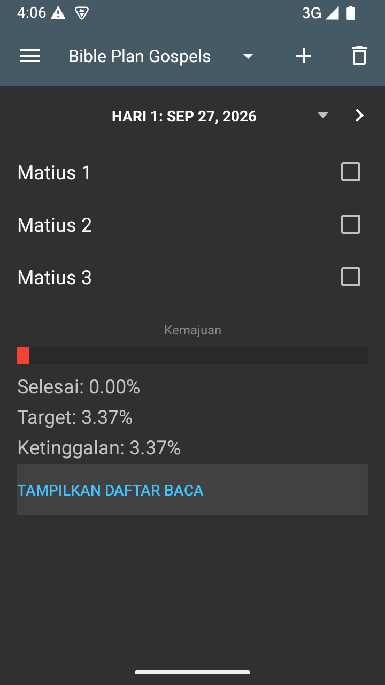
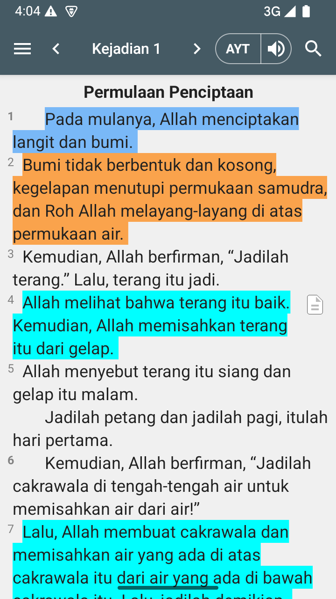
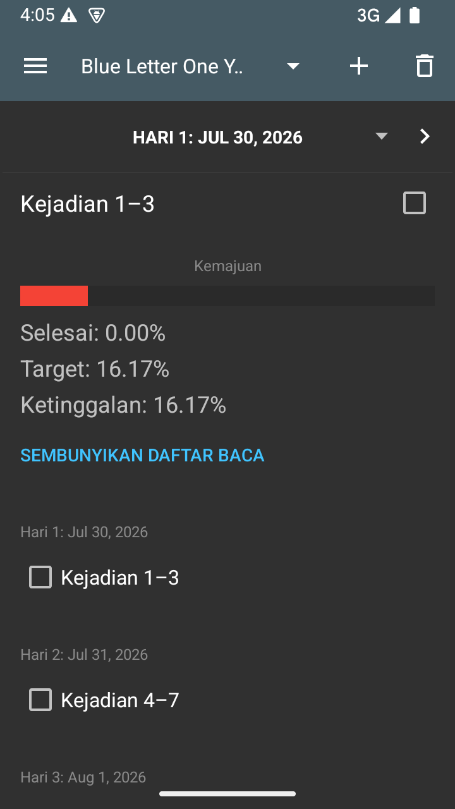
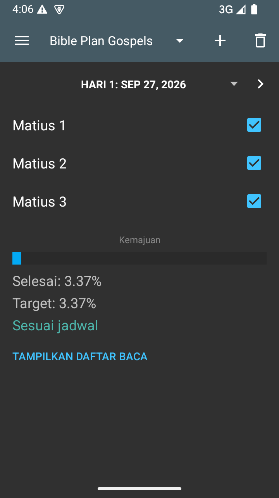
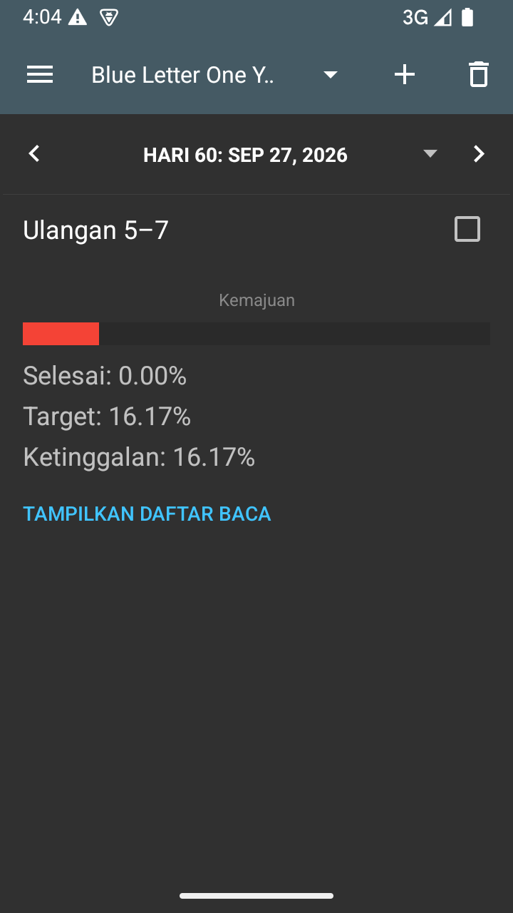
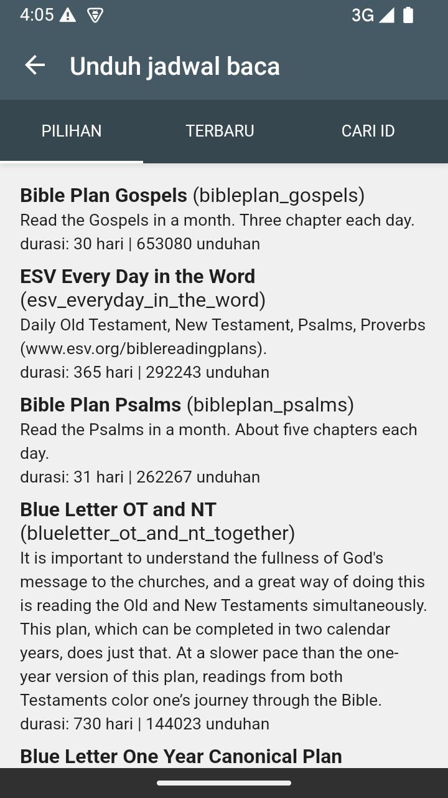
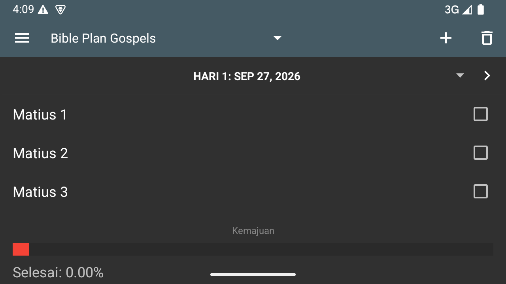
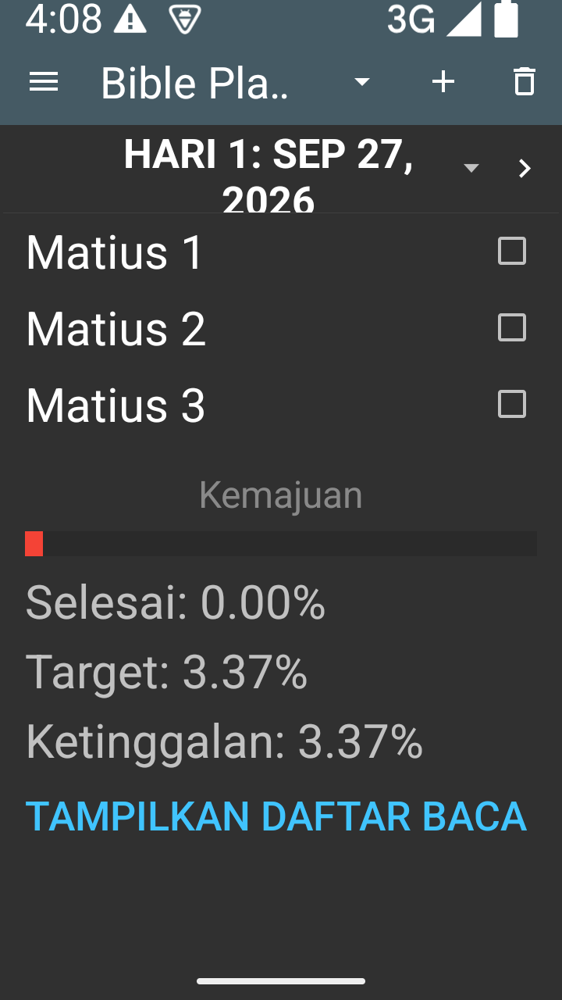

# Reading Plan UX audit

Review date: 2026-09-27.

## Method and confidence

The review combined source inspection with a successful local
`assemblePlainDebug` build and hands-on use through the Android CLI. Runtime
inspection used the existing small-phone Android 15 emulator at 720 by 1280
pixels (360 dp portrait width), an Indonesian app interface, and the AYT Bible
version already selected in the emulator. The tested plans were Blue Letter
One Year Canonical Plan and a newly downloaded Bible Plan Gospels.

The emulator had existing app data. This was not a clean-install onboarding
test. The source checkout was reviewed and run before this documentation
worktree was created from updated `develop`; these screenshots are evidence
of that dated session, not a fresh run of every subsequent repository revision.

Evidence labels:

- **Observed:** directly inspected in the running app or its accessibility tree.
- **Source-verified:** behavior established by the inspected implementation,
  without claiming end-to-end reproduction.
- **Interpretation:** a UX judgment, not a measured user reaction.
- **Unconfirmed:** a risk or suspected defect requiring further testing.

No user interviews, usability study, TalkBack session, production cloud-sync
test, or exhaustive device matrix was performed. The plain debug build does
not establish production Firebase behavior. Font size was tested at 100%,
150%, and 200%; normal size and portrait orientation were restored. Completion
toggles on the newly downloaded Gospel plan were cleared after testing. The
existing yearly plan's completion records were not changed.

## Current journey and strengths

The plan screen presents a toolbar plan switcher, download and delete actions,
a previous/day/next navigation row, passage buttons with right-side checkboxes,
a percentage summary, and an expandable full schedule. Plan information and
Restart are in the app drawer. Date selection, Today, First unread, schedule
adjustment, and starting date share the date menu.

**Observed:** tapping a daily reference opens the ordinary reader. Back returns
to the selected plan day. The checked state is visually clear, and completing
all three Gospel passages changes the summary to "Sesuai jadwal" (on schedule).
These useful behaviors should be retained.

**Source-verified:** individual completion can be checked and unchecked. The
previous/next controls and daily checkbox have 48 dp targets. Installed plan
metadata and progress are stored locally. These facts do not prove complete
offline or accessibility coverage.

## Findings

### A01: Today is treated as overdue immediately

**Observed:** selecting Bible Plan Gospels in the catalogue downloaded and
started the plan immediately. Before any reading, Day 1 showed Finished 0.00%,
Target 3.37%, and Behind 3.37%, with a red segment in the progress bar.

Reproduce by downloading an unstarted Gospel plan and inspecting its initial
summary. Retained progress from an earlier installation can change this result.

**Source-verified:** `countTarget` includes every assigned range through today.
Percentages count assigned passage ranges equally, not verses, reading time,
or fully completed days. Aggregate completion can offset skipped earlier
assignments with readings completed ahead of schedule.

**Interpretation:** a new commitment receives deficit-oriented feedback before
the user begins. The numeric precision does not help choose the next action.
Track the change in RP2-001.

### A02: The reader loses visible plan context

**Observed:** opening Genesis 1 through 3 from the yearly plan showed the normal
reader at Genesis 1. The visible screen had no plan-day indicator, assigned
endpoint, or plan completion action. Back returned to the selected day.
The highlights in the screenshot were existing emulator data, not a treatment
introduced by the reading plan.

**Source-verified:** `CurrentReading` stores only start and end references.
The reader drawer can display that range, jump to its start, and clear it.
It does not retain plan identity, day, and passage sequence for a completion
handoff. Plan progress changes are handled by the plan screen.

**Interpretation:** remembering the endpoint and returning to check completion
adds work between choosing and finishing a reading. Track RP2-002.

### A03: Passage interactions change in the expanded schedule

**Observed:** tapping passage text in the daily list opens reading. Tapping
"Matius 1" in the expanded schedule unchecked it and reduced the completion
percentage. The expanded schedule places checkboxes on the left, while the
daily list places them on the right. It repeats the selected day below the
summary and appends the complete schedule.

**Source-verified:** long-press on an expanded passage offers bulk marking
through that passage. This action was not executed in the session.

**Interpretation:** identical references invite different actions depending on
where they appear, and a long schedule is mixed into the daily task. Track
RP2-003 and RP2-007.

### A04: Completing a day has limited closure

**Observed:** checking all three Day 1 Gospel readings updated the bar and
percentages and displayed "Sesuai jadwal". There was no explicit daily
completion message or next-reading action. Remaining on the day is useful;
the missing feedback is confirmation of the completed daily task.
Track RP2-006. Whole-plan completion was not exercised.

### A05: Toolbar space and content hierarchy compete with reading

**Observed:** the yearly plan title truncated to "Blue Letter One Y.." while
download and delete remained prominent toolbar icons. A single reading was
followed by a larger statistics block and unused space. The day header does
not state the plan's total duration. Plan information and Restart were in the
drawer, separate from date-management actions.

**Interpretation:** the screen's simplicity is valuable, but it gives management
and schedule statistics more prominence than continuing a reading. Track
RP2-005 and RP2-008.

### A06: Catalogue entries are hard to compare

**Observed:** the live catalogue showed Pilihan, Terbaru, and Cari ID tabs.
Entries included internal IDs beside titles, English descriptions amid
Indonesian controls, duration, and download counts. Long descriptions occupied
substantial space. Selecting the Gospel plan immediately downloaded and started
it without a preview or starting-date choice.

These observations apply to the displayed catalogue entries and tested tap;
other tabs, all plans, and error states were not exhaustively inspected.
Download counts are incidental dated content, not product requirements.

**Interpretation:** concise comparable metadata and a preview would support a
more deliberate choice. Search by ID remains useful for shared plans, but IDs
need not dominate every entry. Track RP2-009. A native rewrite is not necessary
to address these findings.

### A07: Rotation discards browsing state

**Observed, reproduced:** on the Gospel plan, select Day 2 (Matthew 4 through 6),
expand the full schedule, and rotate to landscape. The screen returns to Day 1
(Matthew 1 through 3), and the schedule is collapsed. Track RP2-004.

### A08: Large text, date language, and control labels need attention

**Observed:** short Gospel references remained readable at 150% font size.
At 200%, the date wrapped to two lines and crowded the bottom divider; the
plan title truncated further. These tests did not establish clipping of long
passage references. The Indonesian screen displayed an English-format date,
such as "HARI 1: SEP 27, 2026".

**Observed in the accessibility tree:** daily checkboxes had no passage-specific
text or content description. The date control had a generic go-to-date label.
Actual TalkBack announcements were not tested.

**Interpretation:** use flexible sizing, locale-aware dates, and explicit
passage labels. Do not describe untested contrast or screen-reader behavior as
a confirmed failure. Track RP2-010.

## Source-only findings and corrections

- `loadDayNumber` clamps dates before the start to the first day and dates after
  the schedule to its last day. `findFirstUnreadDay` returns the final day when
  nothing remains unread. Explicit future-start, ended-schedule, and completed
  states need validation and design coverage in RP2-001 and RP2-006.
- Schedule adjustment moves the start date so the first unfinished day falls
  on today. It preserves completion. Restart clears completion and resets the
  starting date. Removing a downloaded plan intentionally preserves progress.
  These distinct effects need clearer wording in RP2-008.
- An initial source review suspected that starting-date updates could leave the
  heading and passage list inconsistent. Confirming the current starting date
  during the runtime test produced a consistent Day 1 screen. The mismatch was
  **not reproduced**; investigate under RP2-011 rather than treating it as a bug.
- The module overview's additive-only sync explanation conflicts with
  `ReadingPlanManager.updateReadingPlanProgress`, which supports unchecking.
  Do not assume union-only semantics or remove reversibility during redesign.
  Cross-device behavior still needs its own verification.

## Source map

Links refer to implementations rather than fragile source line numbers.

| Source | Relevant behavior |
| --- | --- |
| [ReadingPlanActivity](../../../Alkitab/src/main/java/yuku/alkitab/base/ac/ReadingPlanActivity.java) | Day navigation, adapter, progress calculations, download, restart, schedule adjustment |
| [CurrentReading](../../../Alkitab/src/main/java/yuku/alkitab/base/util/CurrentReading.kt) | Persisted passage range |
| [IsiActivity](../../../Alkitab/src/main/java/yuku/alkitab/base/IsiActivity.kt) and [LeftDrawer](../../../Alkitab/src/main/java/yuku/alkitab/base/widget/LeftDrawer.java) | Reader handoff and current-reading drawer controls |
| [ReadingPlanManager](../../../Alkitab/src/main/java/yuku/alkitab/base/util/ReadingPlanManager.java) | Plan insertion and reversible completion |
| [InternalDb](../../../Alkitab/src/main/java/yuku/alkitab/base/storage/InternalDb.java) and [ReadingPlanDao](../../../Alkitab/src/main/java/yuku/alkitab/base/storage/ReadingPlanDao.kt) | Removal, retained progress, and start date |
| [HelpActivity](../../../Alkitab/src/main/java/yuku/alkitab/base/ac/HelpActivity.java) | Web catalogue host |
| [Daily layout](../../../Alkitab/src/main/res/layout/item_reading_plan_one_reading.xml), [summary](../../../Alkitab/src/main/res/layout/item_reading_plan_summary.xml), and [navigation](../../../Alkitab/src/main/res/layout/activity_reading_plan_content.xml) | Dimensions, labels, and visual hierarchy |
