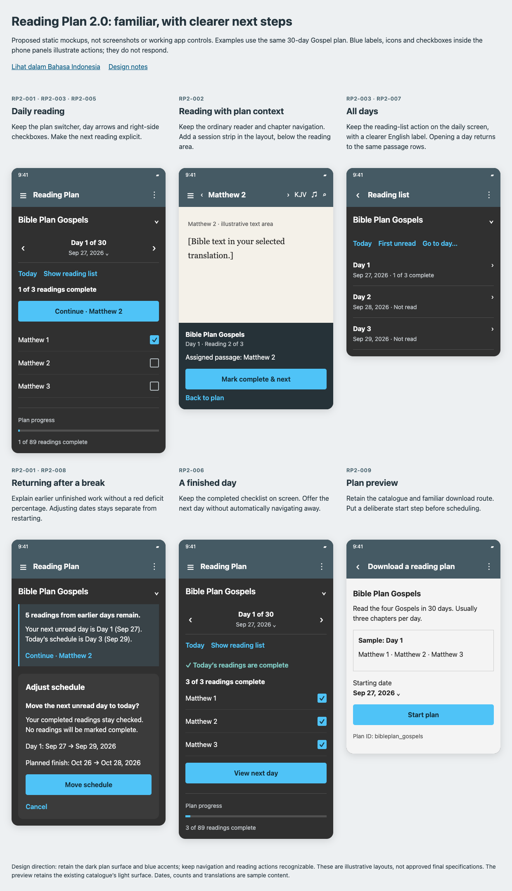
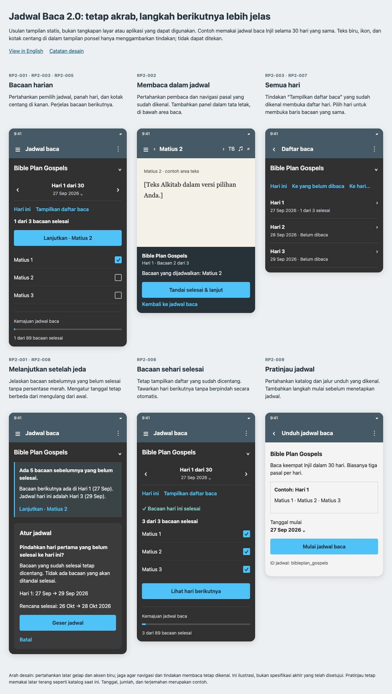

# Bilingual design mockups

Created: 2026-09-28. These are proposed static layouts, not screenshots of a
shipped feature or an interactive app prototype. They illustrate the backlog;
they do not change any entry's Proposed status.

## Open the mockups

- [English HTML](mockups/english.html)
- [Indonesian HTML](mockups/indonesian.html)

Open either file in a browser from a local checkout. Both work offline with the
adjacent `styles.css` file and link to the other language. GitHub displays HTML
source rather than running it; the rendered overview images below are provided
for PR review. Only the language and documentation links are interactive.
Controls drawn inside the phone panels are static illustrations.

| English overview | Indonesian overview |
| --- | --- |
|  |  |

## Familiarity is a design constraint

Existing users should recognize this as the same reading-plan feature. Preserve
the dark plan surface, blue accents, app drawer entry, plan selector, day arrows,
clickable date, passage-first list, and right-side completion checkboxes. Keep
the reader's usual chapter navigation, version/audio controls, and typography.
The schematic icons here do not prescribe replacements for existing app icons.

Change hierarchy and behavior where the audit found a problem; do not introduce
bottom tabs, a new home dashboard, streaks, decorative cards for every passage,
or gesture-only controls merely to make the screen look new.

| Existing landmark | Proposed treatment | Familiarity safeguard |
| --- | --- | --- |
| Toolbar plan dropdown | Full title and dropdown immediately below the toolbar | Keep the selector near the top, show the same plan titles, and preserve current selection. Do not rename downloaded plans. |
| Previous/date/next row | Retain arrows and date; add day total and flexible height | Keep order and meanings. The date still opens date navigation. |
| Reference plus right checkbox | Keep the daily row arrangement everywhere passages appear | References open reading; separate checkboxes toggle completion. Do not make the whole row a completion toggle. |
| Show details / Tampilkan daftar baca | Keep a visible reading-list action on the daily screen; open a dedicated day list | Retain the Indonesian label exactly. Clarify the English label to Show reading list. Back returns to the same day and scroll position. |
| Plus/download and delete icons | Move management into a labeled overflow menu | Include Download a reading plan / Unduh jadwal baca and Remove downloaded plan / Hapus jadwal yang diunduh. Keep the familiar download wording. |
| Date-menu recovery and drawer Restart | Consolidate management without abruptly removing old routes | During the transition, keep the old date-menu and drawer actions as aliases to the same new dialogs. Decide their later removal only after usability validation. |
| Ordinary Bible reader | Add a compact plan-session strip in layout flow | Do not replace chapter navigation or overlay verse text. Back still returns to the plan. |
| Checkmarks after finishing | Keep the completed list visible | Add calm completion feedback and an optional next-day action; never auto-advance. |

Keep familiar English and Indonesian feature names, Reading Plan and Jadwal
baca. The catalogue's original `Bible Plan Gospels` title is deliberately
unchanged in both mockups. The Indonesian description is proposed localized
curated copy, not evidence that arbitrary catalogue content is translated.

## Screen and behavior mapping

| Screen | Backlog | Intended behavior |
| --- | --- | --- |
| Daily reading | RP2-001, RP2-003, RP2-005 | Show daily counts and a named Continue action. Preserve arrows, date, switcher, reference rows, and explicit checks. Today remains directly available. |
| Reader session | RP2-002 | Show assigned passage, day, and sequence. Explicitly complete and advance to the next unfinished passage of that day. Leaving the session does not complete anything. |
| All days | RP2-003, RP2-004, RP2-007 | Show a compact date/status list. Selecting a day opens the same daily passage layout; return preserves position. The mockup shows a sample, not the entire plan. |
| Returning after a break | RP2-001, RP2-008 | Explain earlier unfinished readings and distinguish next unread from today's schedule. The lower panel represents the confirmation opened by Adjust schedule, not a permanent second dashboard. |
| Finished day | RP2-006 | Keep checked rows, confirm completion, and offer optional navigation. The whole-plan completion state remains specified in the backlog and is not illustrated here. |
| Plan preview | RP2-009 | Keep the existing catalogue route and light catalogue surface. Preview the sample day and start date before Start plan. This does not require a native catalogue rewrite. |

The daily state uses September 27, 2026, with Matthew 1 checked and Matthew 2
and 3 unread. The finished state has all three checked. Counts use 89 assigned
readings in the example plan; the UI must calculate actual counts from each
plan, never hardcode these examples.

The recovery example advances today to September 29 while only Matthew 1 is
complete. The two remaining readings from Day 1 plus three from Day 2 make
five earlier unfinished readings. Shifting Day 1 to September 29 moves the
30-day plan's finish from October 26 to October 28, preserving the checkmark.
It does not mark the missed passages read or change their sequence.

## English and Indonesian copy

| English | Indonesian | Meaning |
| --- | --- | --- |
| Continue · Matthew 2 | Lanjutkan · Matius 2 | Open the named unfinished passage, without changing completion. |
| Show reading list | Tampilkan daftar baca | Open the All days destination. |
| First unread | Ke yang belum dibaca | Navigate to the first unfinished assignment. |
| Mark complete & next | Tandai selesai & lanjut | Complete only the active assignment and continue within the same day. |
| Adjust schedule | Atur jadwal | Preview date changes while retaining progress. |
| Move schedule | Geser jadwal | Apply the previewed date change. |
| Today's readings are complete | Bacaan hari ini selesai | Confirm daily completion without navigating away. |
| Start plan | Mulai jadwal baca | Start the selected plan on the chosen date. |

Keep these translations semantically aligned. Date examples deliberately use
English month-first formatting and Indonesian day-first formatting. Reference
names come from the active Bible version in the real app. Reader text is an
explicit placeholder, not a fabricated quotation or a proposed Bible version.

## Review and implementation limits

These layouts are illustrative and responsive, with flexible heights. They do
not prove native Android touch-target dimensions, TalkBack traversal, rotation
restoration, sync correctness, or behavior at the system's largest text size.
Those acceptance checks remain in RP2-004, RP2-010, and RP2-011.

Before accepting the navigation changes, ask existing users in both languages
to switch a plan, open a passage, mark it complete, find another day, and adjust
a schedule. Compare task completion and wrong-action taps with the existing
screen; record where old navigation aliases are used. Preserve progress and
selection through any transition. Keep the existing audit screenshots as the
historical baseline rather than replacing them with these proposals.
