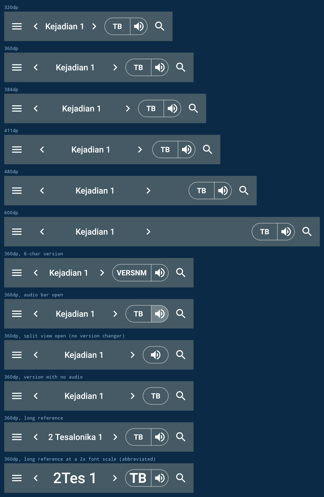

# Reader toolbar in Compose

The reading screen's toolbar is drawn with Jetpack Compose by default
(`useComposeToolbar`, backed by the `useLegacyToolbar` opt-out). It matches
every feature of the view toolbar and applies the space savings measured in
[`audit.md`](audit.md).

To go back to the view toolbar, tick Settings, Experimental, "Reader toolbar
(legacy views)", then reopen the reading screen.



## Where the code is

| File | Role |
|---|---|
| `yuku/alkitab/base/compose/toolbar/ReaderToolbar.kt` | The whole bar: layout, controls, ripples, dimensions |
| `IsiActivity` | Holds `ReaderToolbarState`, implements `ReaderToolbarActions`, installs the `ComposeView` |
| `res/layout/activity_isi_content.xml` | `toolbarHost` frame holding the view toolbar, the `ComposeView`, and the showcase anchor |

## How the two toolbars coexist

`toolbarHost` is a `FrameLayout` sized to `?attr/actionBarSize`. It holds the
AppCompat `Toolbar` and, on top of it, a `ComposeView`.

The AppCompat `Toolbar` stays registered with `setSupportActionBar` even when
the Compose bar is showing. It is what `applyNightModeColors` tints, what
`supportActionBar?.hide()` and `show()` act on for fullscreen, and what hosts
the verse action mode. In Compose mode it is simply emptied: home-as-up is
turned off, `buildMenu` skips the menu inflate, and the two child views
(`bVersion` and the `NavFrameLayout` holding `bGoto`, `bLeft`, `bRight`) are
set to `GONE`. The Compose bar draws no background of its own, so the colour,
including the night-mode override, still comes from the views underneath.

Everything else in `IsiActivity` (insets, `updateToolbarLocation`,
`setFullScreen`) acts on `toolbarHost`, so it does not care which of the two
is drawing.

## State and actions

`ReaderToolbarState` is a data class held in an `IsiActivity` field backed by
`mutableStateOf`. It carries the reference text, the version initials, whether
the version changer is showing, and the two audio flags. It is updated in four
places:

- `display()` sets `reference` and `referenceAbbreviated` next to `bGoto.text`.
- `displayActiveVersion()` sets `versionInitials` next to `bVersion.text`.
- `setVersionChangerVisible()` sets `versionVisible`, called by `SplitViewManager`.
- `buildMenu()` sets `audioAvailable` and `audioBarVisible`, which keeps the
  existing `invalidateOptionsMenu()` calls as the single signal for audio state.

`ReaderToolbarActions` is the outbound side. Each method forwards to the same
`IsiActivity` function the view toolbar calls, so behaviour cannot drift:
drawer toggle, previous and next chapter, goto and history, version dialog,
audio toggle, search.

The drag-to-floater gesture forwards to the same `ReaderGestureHandler` that
`GotoButton.setFloaterDragListener` feeds, with the same screen coordinates.

## What changed from the view toolbar

### Drawer button, 56 dp to 48 dp

`Base.Widget.AppCompat.Toolbar.Button.Navigation` hard-codes
`android:minWidth` to 56 dp, which is why the view toolbar's hamburger is
wider than every other control. Compose lays the button out at 48 dp with a
24 dp glyph.

### Search button, 56 dp to 48 dp

The view toolbar's search item is 56 dp because `ic_menu_search.png` is a
32 dp asset and an action item is sized `max(48dp, icon width + 24dp)`. The
Compose bar uses a 24 dp vector (`ic_search_24.xml`), so 48 dp is enough.

### Material chevrons

The chapter arrows are `ic_chevron_start_24` and `ic_chevron_end_24`, Material
chevrons drawn as 24 dp vectors with `autoMirrored` on, so right-to-left
layouts flip them without a second pair of assets.

### Chevrons flush outward below 411 dp

Below 411 dp the chapter arrows draw against the outer edge of their own box
and the reference's side margin drops to 24 dp, which hands the reference the
space the centred arrows were padding. At 411 dp and above the arrows stay
centred, because the bar already has room. `ReaderToolbar` decides this from
the measured bar width, not from a hard-coded breakpoint list.

### Version changer and speaker as one segmented stadium

The version changer and the audio button share a single stadium outline split
by a hairline that runs the full height of the stadium. The version half is
`max(48dp, text width + 16dp)`; an abbreviation longer than 6 characters is
cut to 5 plus an ellipsis, so a long name cannot push the reference around.
The speaker half is 32 dp.

Either half can be absent. The split view hides the version changer, and a
version with no recording has no audio button. Whichever half is left keeps
the stadium to itself, and the speaker grows to the full 48 dp once it is no
longer sitting inside a target the reader is already aiming at. With both
gone the control takes no width at all.

32 dp is below the 48 dp minimum touch target, and that is deliberate. The
speaker is a secondary, non-destructive control sitting inside a stadium the
user is already aiming at, and it is the only way the bar can pay for putting
audio beside the version it belongs to. Its touch area is still the full bar
height, only its width is short.

Both halves ripple inside the 32 dp stadium rather than over the full bar
height: `SegmentHalf` hoists the `MutableInteractionSource` up to the
full-height clickable box and attaches `indication` to the inner clipped box.
This also fixes a gap in the view toolbar, where the version changer is the
only control with no ripple at all, because `FakeSpinner` replaces the
selectable background with a nine-patch.

### The book abbreviation when the chapter number would be cut off

The chapter number sits at the end of the reference, so whatever the bar cuts
off takes the number with it. A large font size, a long book name or a narrow
bar can leave "2 Tesalonika 1" showing as "2 Tesal...", which is the one part
of the reference the reader cannot guess.

`ReferenceLabel` measures the reference against the box it will actually be
drawn in. If it does not fit whole, it switches to `Book.abbreviation`,
giving "2Tes 1", and stays there whatever happens next: the abbreviation is
the one shorter form there is, so if it is cut too there is nothing further
to try.

The fallback only applies when the version supplies an abbreviation that
differs from the book's short name. The view toolbar does not do this.

### Audio on/off shown by the segment

The view toolbar swaps `ic_audio` for `ic_audio_active`, which adds a small
blue dot to the glyph. The Compose bar instead fills the speaker segment with
a semi-transparent white while the audio bar is open, so the state reads at a
glance and the glyph stays the same.

## Details worth knowing

**Line breaking.** `ReferenceLabel` calls `GotoButton.balanceWrap`, the same
function the view toolbar uses, with a Compose `TextMeasurer` in place of the
paint. Both toolbars break a two-line reference at the same word.

**Drag versus click.** `ReferenceTarget` watches pointer events on
`PointerEventPass.Initial`. Once the finger leaves the button's bounds it
consumes the changes, which cancels the click and long-press underneath and
starts the floater drag. This mirrors `GotoButton.onTouchEvent`.

**The history tip.** `FancyShowCaseView` can only focus on a `View`.
`composeReferenceAnchor` is an invisible zero-size `View` in `toolbarHost`
whose layout params are moved to match the Compose reference button's window
bounds. Focusing on it keeps the library's own status-bar and fullscreen
adjustments, which `focusRectAtPosition` would skip.

**Arrow touch areas.** In the view toolbar `GotoButton.onTouchEvent` returns
false over the outer `nav_prevnext_width - nav_goto_side_margin` on each side
so the arrows keep a full target under the overlapping reference. In Compose
the arrows are separate siblings drawn after the reference target, so they
take their own touches and no such carve-out is needed.

## Measuring it

`ReaderToolbarComposeTest` lays the Compose bar out at every shipping width,
at xxhdpi so 1 dp is 3 px, and checks the slot widths through the reference
bounds the bar reports. It also writes `compose-toolbar.png`, the image above.

```bash
./gradlew :Alkitab:testPlainDebugUnitTest --tests "yuku.alkitab.base.compose.toolbar.ReaderToolbarComposeTest"
```

The audit test (`ReaderToolbarSpaceAuditTest`) measures the view toolbar and
the candidate changes. The numbers it produces are what
[`playground.html`](playground.html) redraws and what the sizes in
`ReaderToolbarDimens` come from.
