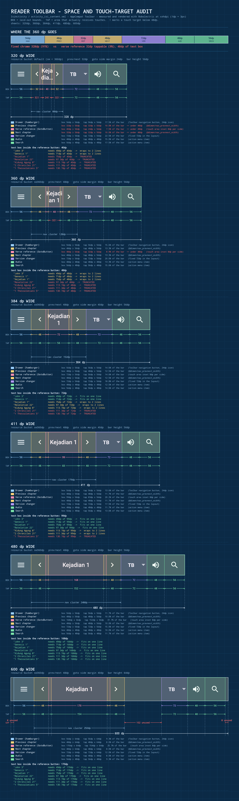
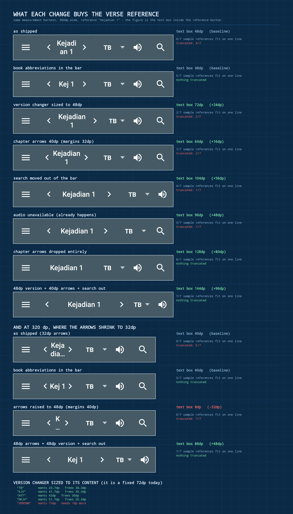
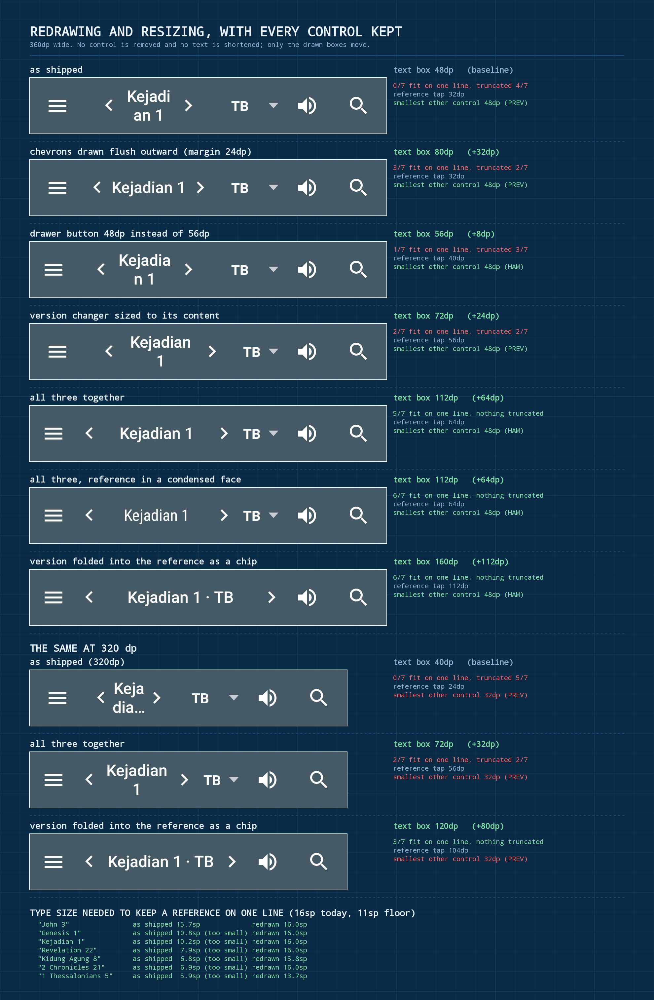

# Reader toolbar space audit

Audit date: 2026-09-21.

The reader toolbar leaves very little room for the verse reference, especially
on a 360 dp phone. This report measures every element in the bar, says how big
its touch area really is, and quantifies what each candidate change would give
back to the reference.



## How this was measured

Nothing here is read off the layout XML. `ReaderToolbarSpaceAuditTest`
(`Alkitab/src/test/java/yuku/alkitab/base/widget/`) inflates the production
`activity_isi_content.xml` into a real `AppCompatActivity`, applies the same
action-bar configuration `IsiActivity` applies (home-as-up with the hamburger
indicator, no title), inflates the production `menu/activity_isi.xml`, then
measures, lays out and draws the toolbar with Robolectric in native graphics
mode. Every figure below is the result of that layout pass, and the toolbar
strips in the images are the actual rendered pixels.

Measurements are taken at xxhdpi so 1 dp is exactly 3 px.

```bash
./gradlew :Alkitab:testPlainDebugUnitTest --tests "yuku.alkitab.base.widget.ReaderToolbarSpaceAuditTest"
```

The run writes `blueprint.png`, `options.png`, `toolbar-<width>dp.png`,
`measurements.md`, `measurements.json` and `options.md` under
`Alkitab/build/reports/toolbar-audit/`. Set `TOOLBAR_AUDIT_DIR` to write
somewhere else.

## What is actually in the bar

Seven elements, left to right: the drawer button, previous chapter, the verse
reference (`GotoButton`), next chapter, the version changer, audio, search.

There is no overflow button. Both items in `menu/activity_isi.xml` are
`showAsAction="always"`, so `ActionMenuView` never reserves an overflow slot.
The seventh icon is search.

## Measurements

`box` is the laid-out rectangle. `tap` is the area that actually receives
touches. `GotoButton.onTouchEvent` returns false for the outermost
`nav_prevnext_width - nav_goto_side_margin` on each side so the chapter arrows
keep their full target, which is why its tap area is narrower than its box.

### 320 dp (resource bucket: default, sw < 360dp)

Bar 320 x 56. prev/next 32, goto side margin 24, nav cluster 88.

| element | left | box w | tap w | tap h | tap >= 48dp |
| --- | ---: | ---: | ---: | ---: | :---: |
| Drawer (hamburger) | 0 | 56 | 56 | 56 | yes |
| Previous chapter | 56 | 32 | 32 | 56 | **no** |
| Verse reference | 80 | 40 | 24 | 56 | **no** |
| Next chapter | 112 | 32 | 32 | 56 | **no** |
| Version changer | 144 | 72 | 72 | 56 | yes |
| Audio | 216 | 48 | 48 | 48 | yes |
| Search | 264 | 56 | 56 | 48 | yes |

### 360 dp (sw360dp)

Bar 360 x 56. prev/next 48, goto side margin 40, nav cluster 128.

| element | left | box w | tap w | tap h | tap >= 48dp |
| --- | ---: | ---: | ---: | ---: | :---: |
| Drawer (hamburger) | 0 | 56 | 56 | 56 | yes |
| Previous chapter | 56 | 48 | 48 | 56 | yes |
| Verse reference | 96 | 48 | 32 | 56 | **no** |
| Next chapter | 136 | 48 | 48 | 56 | yes |
| Version changer | 184 | 72 | 72 | 56 | yes |
| Audio | 256 | 48 | 48 | 48 | yes |
| Search | 304 | 56 | 56 | 48 | yes |

### 384 dp, 411 dp, 480 dp, 600 dp

| width | nav cluster | reference box | reference tap | unclaimed bar |
| ---: | ---: | ---: | ---: | ---: |
| 320 | 88 | 40 | 24 | 0 |
| 360 | 128 | 48 | 32 | 0 |
| 384 | 152 | 72 | 56 | 0 |
| 411 | 179 | 99 | 83 | 0 |
| 480 | 248 | 168 | 152 | 0 |
| 600 | 250 | 170 | 154 | 118 |

Everything other than the reference is a constant across widths: 56 for the
drawer, 48 + 48 for the arrows, 72 for the version changer, 104 for the action
menu. The reference is the only element that absorbs the difference, in both
directions.

### How much reference text fits

Natural single-line width of each sample reference, against the text box the
reference button actually gets:

| reference | needs | 320 dp | 360 dp | 384 dp | 411 dp | 480 dp |
| --- | ---: | :---: | :---: | :---: | :---: | :---: |
| John 3 | 49 | 2 lines | 2 lines | fits | fits | fits |
| Genesis 1 | 71 | 2 lines | 2 lines | fits | fits | fits |
| Kejadian 1 | 75 | truncated | 2 lines | 2 lines | fits | fits |
| Revelation 22 | 97.3 | truncated | truncated | 2 lines | fits | fits |
| Kidung Agung 8 | 113.7 | truncated | truncated | 2 lines | 2 lines | fits |
| 2 Chronicles 21 | 111.3 | truncated | truncated | truncated | 2 lines | fits |
| 1 Thessalonians 5 | 130.7 | truncated | truncated | truncated | truncated | fits |

At 360 dp not one of the seven fits on a single line, and four of seven are
truncated with an ellipsis. "Kejadian 1", the first book of the Indonesian
Bible, renders as "Kejadi / an 1".

## Findings

**1. The reference gets 13% of a 360 dp bar.** Of 360 dp, 312 dp is fixed
chrome and 32 dp is exclusively the reference's (padded out to a 48 dp text box
by overlapping the arrows, see finding 3). The chrome does not shrink as the
screen does, so the reference takes the whole squeeze.

**2. The reference's touch target is under 48 dp on the two most common phone
widths.** 32 dp at 360 dp, 24 dp at 320 dp. It is the one element in the bar
whose target the user cannot hit reliably, and it is also the element with the
largest target in the mental model, since it looks like a wide label.

**3. The chapter arrows take 96 dp of the 128 dp nav cluster at 360 dp**, that
is 75% of the cluster for two icons. The reference button is laid out on top of
them with a 40 dp margin against a 48 dp arrow, so its box borrows 8 dp of
drawing room from each arrow while giving those same 8 dp up for touch. That
trick is why the text box (48 dp) is wider than the tappable area (32 dp).

**4. Chapter navigation already has two other affordances.** A one-finger
horizontal swipe on the verse list (`ReaderGestureHandler.onOnefingerLeft` and
`onOnefingerRight`, enabled by default and turned off only in split view) and
the volume keys. The arrows are the third.

**5. At 320 dp the bar is over-subscribed, and the narrow bucket pays for it in
touch targets.** `values/dimens_nav.xml` shrinks the arrows to 32 dp below
sw360dp. That is not cosmetic: with the sw360dp values the reference would be
8 dp wide and every sample reference would truncate. The shrink is buying the
reference 32 dp at the price of putting three of seven controls below the 48 dp
minimum. The fixed chrome simply does not fit in 320 dp.

**6. The version changer is a hard-coded 72 dp** whatever it shows. Measured
`wrap_content` widths in the same style: "TB" 33.7, "KJV" 41.7, "AYT" 42,
"NKJV" 51.7, "VERSNM" 73. So the fixed width is 20 to 38 dp more than a typical
version needs, and is still 1 dp short of the six-character worst case that
`Version.getInitials` can produce.

**7. The action menu takes 104 dp for two 48 dp icons.** `Toolbar` measures the
`ActionMenuView` before the custom children, and `ActionMenuView` rounds its
cell size up to absorb the space left over after the navigation button. The
extra 8 dp therefore comes out of the reference's budget rather than out of the
bar's slack.

**8. Above 480 dp the bar stops using the space it has.** `NavFrameLayout`
caps itself at 250 dp of screen density. At 600 dp that leaves 118 dp of bar
that no element claims: a 102 dp hole between the next-chapter arrow and the
version changer, plus 8 dp of toolbar padding at each end in the sw600dp
bucket. The reference stops growing at 170 dp while the hole sits next to it.

**9. `GotoButton.balanceWrap` breaks inside words.** It searches every split
position, not only spaces, so when no space split fits it produces "Kejadi /
an 1". A reference is a proper noun plus a number; breaking it mid-word reads
as a rendering bug.

## What each change buys

Same harness, 360 dp, measured rather than estimated.



| change | reference text box | vs shipped | fit on one line | truncated |
| --- | ---: | ---: | ---: | ---: |
| as shipped | 48 dp | baseline | 0/7 | 4/7 |
| book abbreviations in the bar | 48 dp | 0 dp | **5/7** | **0/7** |
| version changer sized to 48 dp | 72 dp | +24 dp | 2/7 | 2/7 |
| chapter arrows 40 dp (margins 32 dp) | 64 dp | +16 dp | 1/7 | 2/7 |
| search moved out of the bar | 104 dp | +56 dp | 4/7 | 1/7 |
| audio unavailable (already happens) | 96 dp | +48 dp | 3/7 | 1/7 |
| chapter arrows dropped entirely | 128 dp | +80 dp | 6/7 | 0/7 |
| 48 dp version + 40 dp arrows + search out | 144 dp | +96 dp | **7/7** | **0/7** |

And at 320 dp, where the arrows are 32 dp:

| change | reference text box | vs shipped | fit on one line | truncated |
| --- | ---: | ---: | ---: | ---: |
| as shipped (32 dp arrows) | 40 dp | baseline | 0/7 | 5/7 |
| book abbreviations in the bar | 40 dp | 0 dp | 3/7 | **0/7** |
| arrows raised to 48 dp (margins 40 dp) | 8 dp | **-32 dp** | 0/7 | **7/7** |
| 48 dp arrows + 48 dp version + search out | 88 dp | +48 dp | **7/7** | **0/7** |

## Custom drawing and resizing, with every control kept

Everything above either removes a control or shortens the text. This section
asks a different question: how much is recoverable by moving only the drawn
boxes, keeping all seven controls, the full book name and 16 sp type?



| change | reference text box | vs shipped | reference tap | smallest other tap | fit on one line | truncated |
| --- | ---: | ---: | ---: | ---: | ---: | ---: |
| as shipped | 48 dp | baseline | 32 dp | 48 dp | 0/7 | 4/7 |
| chevrons drawn flush outward | 80 dp | +32 dp | 32 dp | 48 dp | 3/7 | 2/7 |
| drawer button 48 dp instead of 56 dp | 56 dp | +8 dp | 40 dp | 48 dp | 1/7 | 3/7 |
| version changer sized to its content | 72 dp | +24 dp | 56 dp | 48 dp | 2/7 | 2/7 |
| **all three together** | **112 dp** | **+64 dp** | **64 dp** | **48 dp** | 5/7 | **0/7** |
| all three, condensed face | 112 dp | +64 dp | 64 dp | 48 dp | 6/7 | **0/7** |
| version folded into the reference as a chip | 160 dp | +112 dp | 112 dp | 48 dp | 6/7 | **0/7** |

At 320 dp the same three changes take the reference from 40 dp to 72 dp and
truncations from 5/7 to 2/7; with the version folded in, from 40 dp to 120 dp
and nothing truncates.

### The techniques

**Chevrons drawn flush outward (+32 dp).** The arrows are 24 dp glyphs
centred in 48 dp boxes, so 24 dp of each box is empty padding that the
reference is nevertheless kept out of. Draw each glyph in the outer 24 dp of
its own box and start the reference's box where the glyph ends: margin 24 dp
instead of 40 dp. The arrows keep their full 48 dp rectangles, so nothing
changes for touch at all, and the glyphs and the text still do not overlap.
This is the 8 dp overlap the layout already uses, taken to its limit.

**Drawer button 48 dp instead of 56 dp (+8 dp).** The navigation button is
sized by `?actionBarSize`, not by its 24 dp icon. A 48 dp button with
`contentInsetStartWithNavigation` lowered to match is still a compliant target.

**Version changer sized to its content (+24 dp).** `wrap_content` with a 48 dp
floor and a ceiling for the six-character worst case, instead of a flat 72 dp.

**Version folded into the reference as a chip (+112 dp total).** Draw the
initials inside the reference's own box, as `Kejadian 1 · TB`, and hit-test the
chip separately. This returns the whole 72 dp version box to the cluster; the
chip then costs about 28 dp back out of it. Measured with the chip included in
the string, so the figures above already pay for it. A vertical variant (the
initials on a second line under the reference) would free the same 72 dp, but
it splits the 56 dp bar height into two sub-48 dp tap strips, so the inline
chip is the safer of the two.

**A condensed face for the reference costs nothing and buys one more
reference.** After the other changes it takes one-line fits from 5/7 to 6/7.

**Type size barely has to move.** After the redraws, six of seven sample
references still fit at the full 16 sp; only "1 Thessalonians 5" needs to come
down, to 13.7 sp. As shipped, six of seven would need to drop below 11 sp,
which is why auto-sizing on its own is not a fix.

### What is not recoverable this way

The action menu's 104 dp for two 48 dp icons is its floor. Forcing
`ActionMenuView` narrower demotes an item rather than tightening its cells: the
narrowest exact width that still leaves both items at 48 dp is 104 dp. Those
8 dp only come back by replacing the action menu with a custom container for
the trailing icons, which is a lot of machinery for 8 dp.

## Suggestions

In the order they are worth doing.

**0. Do the three redraws first.** Chevrons flush outward, a 48 dp drawer
button and a content-sized version changer take the reference from 48 dp to
112 dp at 360 dp, remove every truncation, and raise the reference's own touch
area from 32 dp to 64 dp, without removing a control, shortening a name or
shrinking the type. Nothing else on this list has that ratio of gain to
behaviour change, and it makes the rest optional rather than necessary.

**A. Fall back to `Book.abbreviation` when the full name does not fit.** Every
`Book` already carries an `abbreviation` (`BookNameSorter` and the goto dialer
use it). Rendering "Kej 1" instead of "Kejadian 1" costs no layout change at
all and takes the 360 dp bar from nothing fitting and four truncations to five
of seven fitting on one line and zero truncations. Measure the full name first
and only fall back when it would wrap or truncate, so wide screens keep the
full name.

**B. Size the version changer to its content.** `wrap_content` with
`minWidth` at 48 dp and a `maxWidth` so a six-character initialism still fits.
Frees 20 to 38 dp for the reference on a typical install, and fixes the 1 dp
clip on the worst case. Low risk, no behaviour change. This is part of the
redraw package in suggestion 0.

**C. Give the reference the touch area its box implies.** Suggestion 0 already
takes it from 32 dp to 64 dp. If the box is not widened, drop the
`untouchableSideWidth` inset in `GotoButton.onTouchEvent` instead and let the
arrows keep only their own 48 dp. Today the one element that looks like a large
target is the only one below 48 dp.

**D. Stop shrinking the arrows below sw360dp, but only together with B and E.**
Keeping 48 dp / 40 dp everywhere is what makes every touch target compliant,
and on its own at 320 dp it is a disaster: measured, the reference collapses to
8 dp and all seven samples truncate. With the version changer sized to its
content and search out of the bar, the same 320 dp screen gets a 88 dp
reference and all seven samples fit. Treat the narrow bucket as a symptom of an
over-subscribed bar, and remove the cause before removing the bucket.

**E. Move search out of the top bar.** This is the single largest recoverable
block at +56 dp, and search is the least frequently used of the three trailing
controls in a reading screen. The left drawer has no search entry today, so it
would need one. Note that moving it to the overflow menu instead is not worth
doing: the overflow button itself costs 48 dp, so the net gain would be 8 dp.

**F. Let the reference use the space on wide screens.** Raise or remove the
250 dp cap in `NavFrameLayout`, or replace the fixed cluster with a centred
reference that expands. 118 dp of a 600 dp bar is currently unclaimed.

**G. Only break the reference at a space.** In `GotoButton.balanceWrap`,
restrict split candidates to space positions and, when no space split fits,
keep one line and ellipsize (or auto-size the text down) instead of cutting a
word in half.

**H. Leave the action menu alone.** Its 104 dp is a floor, not slack: forcing
`ActionMenuView` narrower demotes an item. The 8 dp only comes back with a
custom trailing-icon container, which is not worth it on its own.

Suggestion 0 is the one to do first, and on its own it removes every truncation
at 360 dp with nothing taken away from the user. A is the cheapest complement
and is what closes the remaining gap at 320 dp. Everything from E down is a
product decision rather than a layout one.
